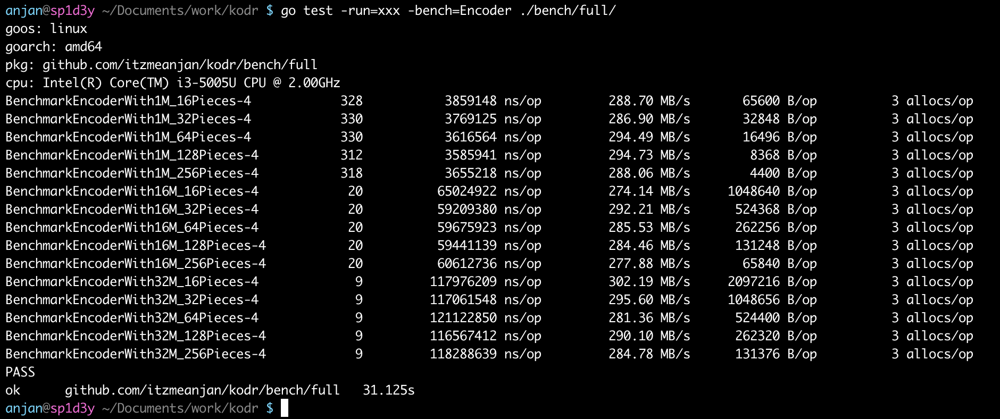
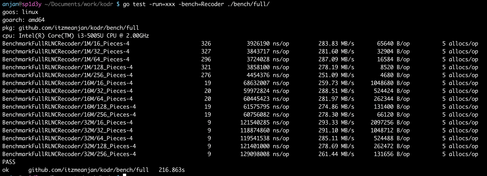
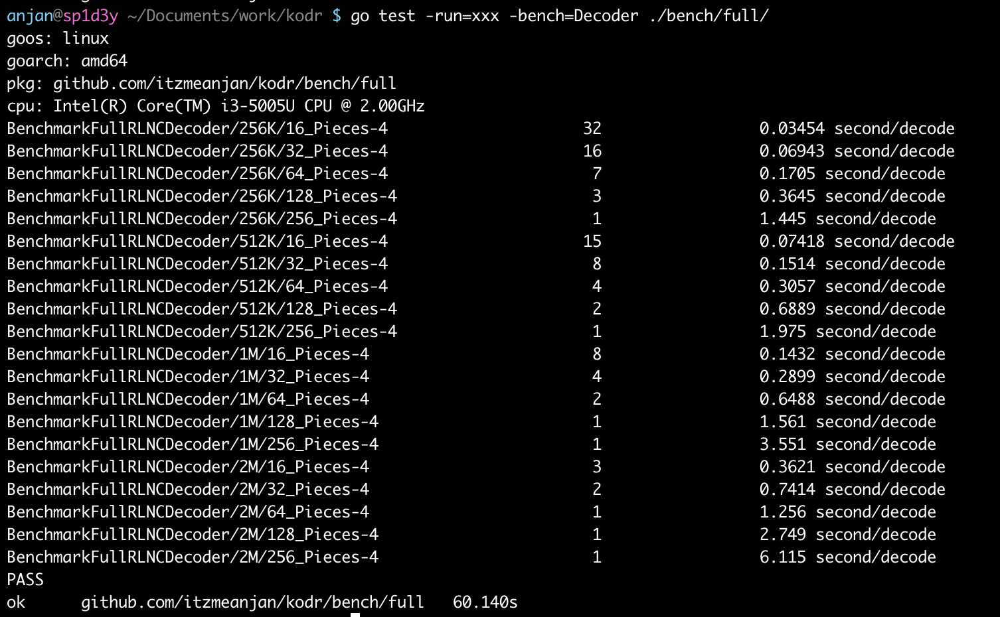
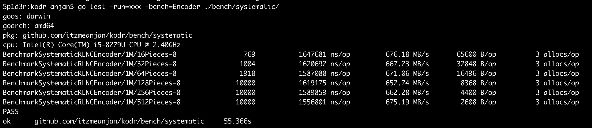
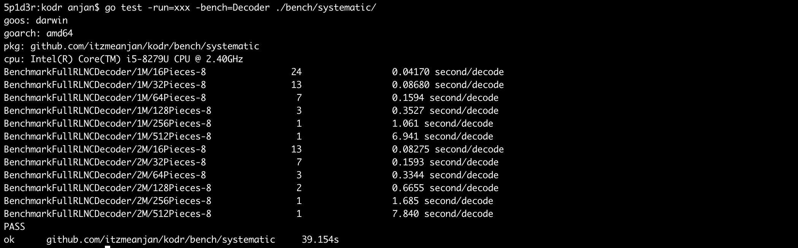
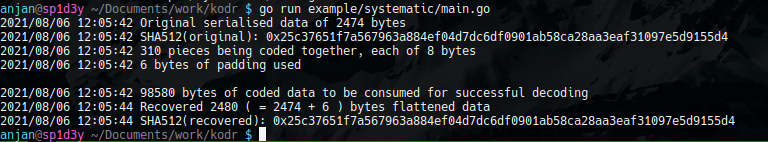

# kodr


Random Linear Network Coding

## Motivation

For sometime now I've been exploring **R**andom **L**inear **N**etwork **C**oding & while looking for implementation(s) of RLNC-based schemes I didn't find stable & maintained library in *Golang*, which made me take up this venture of writing **kodr**, which I plan to maintain & keep updated as I keep learning of new RLNC schemes & possible application domains of RLNC.

For all the RLNC-based schemes I implement in **kodr** i.e. _{full RLNC, on-the-fly RLNC, sparse RLNC, generational RLNC, Caterpillar RLNC ...}_, I write respective examples on how exposed API can be used for *encoding, recoding & decoding* binary data.

## Background

For learning about RLNC you may want to go through my [post](https://itzmeanjan.in/pages/rlnc-in-depth.html). In **kodr**, I perform all finite field operations on GF(2\*\*8) --- which is seemingly a good fit, because I consider each byte to be a symbol of RLNC, which is a finite field elements --- 256 of them. Also speaking of performance & memory consumption, GF(2\*\*8) keeps a good balance between these. Working on higher field indeed decreases chance of ( randomly ) generating linearly dependent pieces, but requires more costly computation & if finite field operations are implemented in terms of addition/ multiplication tables then memory consumption increases to a great extent. On the other hand, working on GF(2) increases change of generating linearly dependent pieces, though with sophisticated design like Fulcrum codes, they can be proved to be beneficial. Another point is the higher the finite field, higher is the cost of storing random coding vectors --- because each element of coding vector ( read coding coefficient ) is a finite field element.

## Installation

Assuming you have Golang (>=1.16) installed, add **kodr** as an dependency to your project, which uses *GOMOD* for dependency management purposes, by executing

```bash
go get -u github.com/itzmeanjan/kodr/...
```

## Testing

After you clone this repo, you may want to run test cases

```bash
go test -v -cover ./...
```

## Benchmarking

I write required testcases for benchmarking performance of {en, re, de}coder of implemented RLNC schemes, while I also present results after running those on consumer grade machines with configuration

- `Intel(R) Core(TM) i3-5005U CPU @ 2.00GHz`
- `Intel(R) Core(TM) i5-8279U CPU @ 2.40GHz`

---

### Full RLNC

For benchmarking **encoder** of full RLNC, execute

```bash
go test -run=xxx -bench=Encoder ./bench/full/
```

> Coding speed at **~ 290MB/s**



Looking at full RLNC **recoder** performance

```bash
go test -run=xxx -bench=Recoder ./bench/full/
```

> Recoding speed at **~ 290MB/s**



And **decoder** performance denotes each round of full data reconstruction from N-many coded pieces taking `X second`, on average. 

> Note: It can be clearly understood that decoding complexity keeps increasing very fast, when using full RLNC with large data chunks. For decoding 2MB total chunk which is splitted into 256 pieces of equal sized byte slice, it takes ~6s.



---

### Systematic RLNC

Running benchmark tests on better hardware shows encoder performance improvement to quite a large extent

> Average encoding speed **~660MB/s**

```bash
go test -run=xxx -bench=Encoder ./bench/systematic
```



Systematic RLNC decoder has an advantage over full RLNC decoder because it may get some pieces which are actually uncoded, just augmented to be coded, so it doesn't need to process those pieces, rather it'll use uncoded pieces to decode other coded pieces faster.

```bash
go test -run=xxx -bench=Decoder ./bench/systematic
```

> For decoding 1MB whole chunk, which is splitted into 512 pieces & coded, it takes quite long time --- growth rate of decoding time is pretty high as piece count keeps increasing. It's better not to increase piece count very much, rather piece size can increase, so that we pay relatively lower decoding cost.

> Notice how whole chunk size increases to 2MB, but with small piece count decoding time stays afforable.



## Usage

Examples demonstrating how to use API exposed by **kodr** for _( currently )_ supported RLNC schemes.

> In each walk through, code snippets are prepended with line numbers, denoting actual line numbers in respective file.

---

### Full RLNC

**Example:** `example/full/main.go`

Let's start by seeding random number generator with current unix timestamp with nanosecond level precision.

```go
22| rand.Seed(time.Now().UnixNano())
```

I read **kodr** [logo](#kodr), which is a PNG file, into in-memory byte array of length 3965 & compute SHA512 hash : `0xee9ec63a713ab67d82e0316d24ea646f7c5fb745ede9c462580eca5f`

```go
24| img := path.Join("..", "..", "img", "logo.png")

...

37| log.Printf("SHA512: 0x%s\n\n", hex.EncodeToString(sum))
```

I decide to split it into 64 pieces ( each of equal length ) & perform full RLNC, resulting into 128 coded pieces.

```go
45| log.Printf("Coding %d pieces together\n", pieceCount)
46| enc, err := full.NewFullRLNCEncoderWithPieceCount(data, pieceCount)

...

57| log.Printf("Coded into %d pieces\n", codedPieceCount)
```

Then I randomly drop 32 coded pieces, simulating these are lost/ dropped. I've 96 remaining pieces, which I recode into 192 coded pieces. I random shuffle those 192 coded pieces to simulate that their reception order can arbitrarily vary. Then I randomly drop 96 pieces, leaving me with other 96 pieces.

```go
59| for i := 0; i < int(droppedPieceCount); i++ {

...

98| log.Printf("Dropped %d pieces, remaining %d pieces\n\n", recodedPieceCount/2, len(recodedPieces))
```

Now I create a decoder which expects to receive 64 linearly independent pieces so that it can fully construct back **kodr** logo. I've 96 pieces, with no idea whether they're linearly independent or not, still I start decoding.

```go
101| dec := full.NewFullRLNCDecoder(pieceCount)
```

Courageously I just add 64 coded pieces into decoder & hope all of those will be linearly independent --- turns out to be so. 

> This is the power of RLNC, where random coding coefficients do same job as other specially crafted codes.

Just a catch, decoded data's length is more than 3965 bytes.

```go
124| log.Printf("Decoded into %d bytes\n", len(decoded_data)) // 3968 bytes
```

This is due to fact, I asked **kodr** to split original 3965 bytes into 64 pieces & code them together, but turns out 3965 is not properly divisible by 64, which is why **kodr** decided to append 3 extra bytes at end --- making it 3968 bytes. This way **kodr** splitted whole image into 64 equal sized pieces, where each piece size is 62 bytes.

So, SHA512-ing first 3965 bytes of decoded data slice must be equal to `0xee9ec63a713ab67d82e0316d24ea646f7c5fb745ede9c462580eca5f` --- and it's so.

```go
131| log.Printf("First %d bytes of decoded data matches original %d bytes\n", len(data), len(data))

...

137| log.Printf("SHA512: 0x%s\n", hex.EncodeToString(sum))
```

Finally I write back reconstructed image into PNG file.

```go
139| if err := os.WriteFile("recovered.png", decoded_data[:len(data)], 0o644); err != nil {

...
```

For running this example

```bash
# assuming you're in root directory of `kodr`
cd example/full
go run main.go
```

This should generate `example/full/recovered.png`, which is exactly same as `img/logo.png`.

---

### Systematic RLNC

**Example: `example/systematic/main.go`**

I start by seeding random number generator with device's nanosecond precision time

```go
46| rand.Seed(time.Now().UnixNano())
```

I define one structure for storing randomly generated values, which I serialise to JSON.

```go
17| type Data struct {
.	FieldA uint    `json:"fieldA"`
.	FieldB float64 `json:"fieldB"`
.	FieldC bool    `json:"fieldC"`
.	FieldD []byte  `json:"fieldD"`
22| }
```

For filling up this structure, I invoke random data generator

```go
48| data := randData()
```

I calculate SHA512 hash of JSON serialised data, which turns out to be `0x25c37651f7a567963a884ef04d7dc6df0901ab58ca28aa3eaf31097e5d9155d4` in this run.

```go
56| hasher := sha512.New512_256()

.
.

59| log.Printf("SHA512(original): 0x%s\n", hex.EncodeToString(sum))
```

I decide to split serialised data into N-many pieces, each of length 8 bytes.

```go
61| var (
62|		pieceSize uint = 1 << 3 // in bytes
63| )

65| enc, err := systematic.NewSystematicRLNCEncoderWithPieceSize(m_data, pieceSize)
66| if err != nil { /* exit */ }
```

So I've generated 2474 bytes of JSON serialised data, which after splitting into equal sized byte slices ( read original pieces ), I get 310 pieces --- pieces which are to be coded together. It requires me to append 6 empty bytes --- `8 x 310 - 6 = 2480 - 6 = 2474 bytes`

Systematic encoder also informs me, I need to consume 98580 bytes of coded data to construct original pieces i.e. original JSON serialised data.

I simulate some pieces collected, while some are dropped

```go
75| dec := systematic.NewSystematicRLNCDecoder(enc.PieceCount())
76| for {
	c_piece := enc.CodedPiece()

	// simulating piece drop/ loss
	if rand.Intn(2) == 0 {
		continue
	}

	err := dec.AddPiece(c_piece)
    ...
88| }
```

> Note: As these pieces are coded using systematic encoder, first N-many pieces ( here N = 310 ), are kept uncoded though they're augmented to be coded by providing with coding vector which has only one non-zero element. Next coded pieces i.e. >310th carry randomly generated coding vectors as usual.

I'm able to recover 2480 bytes of serialised data, but notice, padding is counted. So I strip out last 6 padding bytes, which results into 2474 bytes of serialised data. Computing SHA512 on recovered data must produce same hash as found with original data.

And it's indeed same hash `0x25c37651f7a567963a884ef04d7dc6df0901ab58ca28aa3eaf31097e5d9155d4` --- asserting reconstructed data is same as original data, when padding bytes stripped out.



For running this example

```bash
pushd example/systematic
go run main.go
popd
```

> Note: Your console log is probably going to be different than mine.

---

**More schemes coming soon !**
